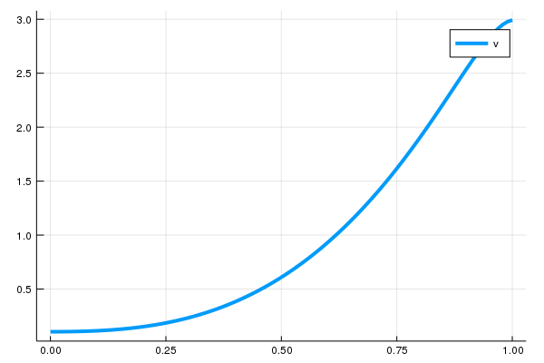
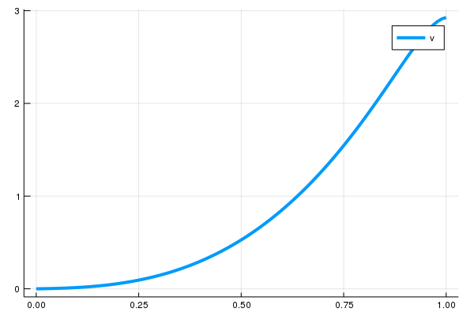
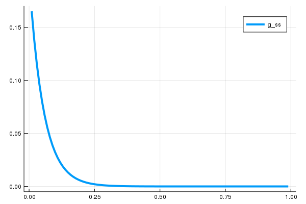

[SimpleDifferentialOperators.jl](https://github.com/QuantEcon/SimpleDifferentialOperators.jl/)
=============

## Installation

To install, run
```julia
] add SimpleDifferentialOperators
```

Note that this requires Julia 1.1 or later.

## Usage

### Solving HJBE with constant drifts
-------------
Consider solving for `v` from the following equation by the Hamilton-Jacobi-Bellman equation (HJBE):
```math
\rho v(x) = f(x) + \mu \partial_x v(x) + \frac{\sigma^2}{2} \partial_{xx} v(x)
```

for some constant $\rho, \sigma > 0$ and $\mu \leq 0$. To solve `v` under the reflecting barrier conditions $v'(0) = v'(1) = 0$ on `M`-size discretized grids, one can run the following code:
```juliax   
# import LinearAlgebra package (for diagonal and identity matrices)
using LinearAlgebra 
# setup 
f(x) = x^2 
μ = -0.1 # constant negative drift
σ = 0.1
ρ = 0.05
M = 100 # size of grid
x = range(0.0, 1.0, length = M) # grid

# discretize L = ρ - μ D_x - σ^2 / 2 D_xx
# subject to reflecting barriers at 0 and 1
bc = (Reflecting(), Reflecting())
L = I * ρ - μ*L₁₋(x, bc) - σ^2 / 2 * L₂(x, bc)
## solve the value function
v = L \ f.(x) 
```

Note that the code above uses differential operators with reflecting boundary conditions applied. 
One can alternatively use differential operators on interior nodes and stack them with matrices for boundary conditions to compute `v`:
```julia
# import SparseArrays package (for identity matrix and spzeros)
using SparseArrays

# differential operators on extended nodes
L̄ₓ = μ*L̄₁₋(x) + σ^2 / 2 * L̄₂(x)

# boundary conditions (i.e. B v̄ = b)
B = transpose([[-1; 1; zeros(M)] [zeros(M); -1; 1]])
b = [0.0; 0.0] 

# form bellman equation on extension
L̄ = [spzeros(M) ρ*I spzeros(M)] - L̄ₓ

# stack the systems of bellman and boundary conditions, and solve
v̄ =  [L̄; B] \ [f.(x); b]

# extract the interior (is identical with `v` above)
v =  v̄[2:end-1] 
```


Here is a plot for `v`:

```julia
using Plots
plot(x, v, lw = 4, label = "v")
```



### Solving HJBE with absorbing barrier conditions
Instead of having the reflecting barrier conditions on both lower bound and upper bound $v'(0) = v'(1) = 0$ as above, one can impose an absorbing barrier condition as well. To solve `v` under the reflecting barrier conditions $v(0) = S$ (absorbing barrier on lower bound) for some S and $v'(1) = 0$ (reflecting barrier on upper bound), one can construct `B` and `b` for the boundary conditions as follows:
```julia
# define S
S = 0.0 

# boundary conditions (i.e. B v̄ = b)
B = transpose([[0; 1; zeros(M)] [zeros(M); -1; 1]])
b = [S; 0.0];
```

and solve `v`:
```julia
# stack the systems of bellman and boundary conditions, and solve
v̄ =  [L̄; B] \ [f.(x); b]

# extract the interior (is identical with `v` above)
v =  v̄[2:end-1] 
```

Note that this can be alternatively done by 

Here is a plot for `v`:

```julia
plot(x, v, lw = 4, label = "v")
```



### Solving HJBE with state-dependent drifts
-------------
One can also deploy upwind schemes when drift variable is not constant. Consider solving for `v` from the following Bellman equation:
```math
\rho v(x) = f(x) + \mu(x) \partial_x v(x) + \frac{\sigma^2}{2} \partial_{xx} v(x)
```

associated with the diffusion process
```math
dx = \mu(x) dt + \sigma dW
```

for some constant $\rho, \sigma > 0$ and $\mu(x) = -x$. Note that $\mu(x)$ depends on states. The following code will solve `v` using upwind schemes, with the reflecting barrier conditions $v'(0) = v'(1) = 0$ applied:
```julia
# setup 
f(x) = x^2 
μ(x) = -x # drift depends on state
σ = 1.0
ρ = 0.05
M = 100 # size of grid
x = range(-1.0, 1.0, length = 100)

bc = (Reflecting(), Reflecting())

# Define first order differential operator using upwind scheme
L₁ = Diagonal(min.(μ.(x), 0.0)) * L₁₋(x, bc) + Diagonal(max.(μ.(x), 0.0)) * L₁₊(x, bc)

# Define linear operator using upwind schemes
L = L₁ - σ^2 / 2 * L₂(x,bc)

# solve the value function
v = (I * ρ - L) \ f.(x) 
```

### Finding stationary distribution from the Kolmogorov forward equation (KFE)
-------------
One can also compute the stationary distribution of the state `x` above from the corresponding KFE:
```math
\partial_{t} g(x,t) = - \mu(x) \partial_{x} g(x, t) + \frac{\sigma^2}{2} \partial_{xx} g(x,t)
```
by taking $\partial_{t} g(x,t) = 0$, i.e., solving $g$ from the $L^* g(x) = 0$ where
```math
L^* = - \mu(x) \partial_{x} + \frac{\sigma^2}{2} \partial_{xx}
```

By descretizing the space of $x$, one can solve the corresponding system by using discretized operators for ${L}^*$. Note that the operator for the KFE in the original equation is the adjoint operator of the operator for the HJBE, ${L}$, and the correct discretization scheme for $L^*$ is, analogously, done by taking the transpose of the discretized operator for HJBE, $L$ (See [Gabaix et al., 2016](https://doi.org/10.3982/ECTA13569) and [Achdou et al., 2017](https://ideas.repec.org/p/nbr/nberwo/23732.html)). Hence, one can find the stationary distribution by solving the following discretized system of equations:

```math
L^T g = 0
```

such that the sum of $g$ is one. This can be found by finding a non-trivial eigenvector for $L^T$  associated with the eigenvalue of zero:

```julia
using Arpack # library for extracting eigenvalues and eigenvectors

# extract eigenvalues and eigenvectors, smallest eigenval in magintute first
λ, ϕ = eigs(transpose(L), which = :SM); 
# extract the very first eigenvector (associated with the smallest eigenvalue)
g_ss = real.(ϕ[:,1]);
# normalize it
g_ss = g_ss / sum(g_ss)
```

Using `L` from the state-dependent drift example above, this results in the following stationary distribution:

```julia
plot(x, g_ss, lw = 4, label = "g_ss")
```

